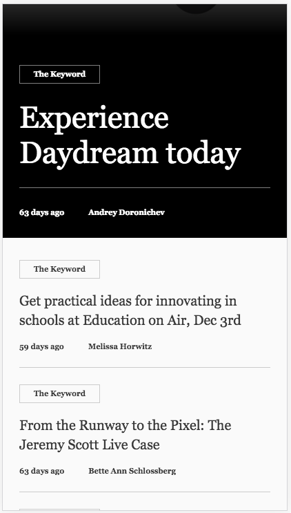

<!-- toc -->


News is a full-featured Progressive Web App demo built using the
Toolbox. You can try it out here:

<a href="https://news.polymer-project.org/" class="docs-button">Launch News demo
</a>

This case study shows how News uses the App Toolbox to deliver a great
user experience.

## App structure

The News app is made up of two main views: list view and article view.

<div class="image-container layout horizontal" style="max-width: 600px;">
  <div class="image-wrapper">
    
  </div>
  <div class="image-wrapper">
    
  </div>
</div>

`<news-app>`
News uses an [application shell architecture](https://developers.google.com/web/fundamentals/architecture/app-shell),
with the `<app-shell>` top-level element providing the main framework for the app.
The app is composed of `<app-
drawer>`, `<app-header>` and `<iron-pages>` elements
to form the basic structure of the app layout. These elements are themeslves
composed of reusable components like buttons and tabs.

<!--  -->

##Routing

The news app’s client-side URL routing is based on the `<app-route>` element,
a modular routing element. `<app-route>` uses the category in the URL to route to the appropriate view:

`news-list.html` { .caption }
```
<app-route
  route="[[route]]"
  pattern="/:category"
  data="{{_routeData}}"></app-route>
```

Category names are stored in the `<news-data>` element.

More information:

-   [Encapsulated routing with elements](/1.0/blog/routing)
-   [`<app-route>` API reference](https://elements.polymer-project.org/elements/app-route)

## Views

Views are created lazily on demand. Initially, views are inactive and are instances
of HTMLElement. Polymer uses the Custom Elements API to upgrade these elements to
fully-functioning components when the view is switched.

`news-app.html` { .caption }
```
_pageChanged: function(page, oldPage) {
  if (page != null) {
    this.importHref(
      this.resolveUrl('news-' + page + '.html'),
      function() {
        this._pageLoaded(Boolean(oldPage));
      }, null, true);
  }
},
```
`<news-app>` fetches articles and images from the /data/articles folder via the
`<news-data>` element, and passes it to views for display.

`news-app.html` { .caption }
```
 <news-data
        id="data"
        categories="{{categories}}"
        category-name="[[categoryName]]"
        category="{{category}}"
        article-id="[[articleId]]"
        article="{{article}}"
        loading="{{loading}}"
        offline="[[offline]]"
        failure="{{failure}}"></news-data>
```

`<news-app>` also manages the document title and a11y announcer.

`news-app.html` { .caption }
````
// Elements in the app can notify section changes.
// Response by a11y announcing the section and syncronizing the category.
_updateDocumentTitle: function(page, categoryTitle, articleHeadline) {
  document.title = (page === 'list' ? categoryTitle : articleHeadline) + ' - NEWS';
},
````

###`<news-list>`

The `<news-list>` element displays a list of articles for the selected category - for example,
Top Stories. The `<news-list>` template uses styles in `<app-layout>` to create responsive layout
for different sized devices.

When offline and the category data is not cached, `<news-list>` displays a network error via
the `<news-network-warning>` element:

`news-list.html` { .caption }
```
    <news-network-warning
        hidden$="[[!failure]]"
        offline="[[offline]]"
        on-try-reconnect="_tryReconnect"></news-network-warning>
```

If the user is offline but category data is cached and ServiceWorker is installed,
the cached content is displayed.

###`<news-article>`

The `<news-article>` element displays the article content. It too uses a responsive layout, and responds to offline status in the same way as `<news-list>`.

#Extending the News app

##Hooking up data

All article list and article content data come from `<news-data>` via notifying properties.
Initially, `<news-data>` provides a list of category objects (the `categories` notifying property).
This is specified by `categoryList` in news-data.html.

`news-data.html` { .caption }
```
    Polymer({
      is: 'news-data',
      properties: {
        categories: {
          type: Array,
          value: categoryList,
          readOnly: true,
          notify: true
        },
        categoryName: String,
```

```
    var categoryList = [
      {name: 'top_stories', title: 'Top Stories'},
      {name: 'doodles', title: 'Doodles'},
      {name: 'chrome', title: 'Chrome'},
      {name: 'search', title: 'Search'},
      {name: 'shopping_payments', title: 'Shopping & Payments'},
      {name: 'nonprofits', title: 'Nonprofits'}
    ];
```   

By setting the `categoryName` property, `<news-data>` will set the `category` notifying
property to the category object in the categories list with the matching name:

`news-data.html` { .caption }
```
        category: {
          type: Object,
          computed: '_computeCategory(categoryName)',
          notify: true
        },
```

`news-data.html` { .caption }
```
 _computeCategory: function(categoryName) {
        for (var i = 0, c; c = this.categories[i]; ++i) {
          if (c.name === categoryName) {
            return c;
          }
        }
        return null;
      },
```

It will then initiate an XHR to query the list of articles in that category
(e.g. /data/top_stories.json):

`news-data.html` { .caption }
```
_fetchCategory: function(category, offline, attempts) {
        // Don't fail if we become offline but already have a cached version, or if there's
        // nothing to fetch, or if something else is already fetching (since all instances of
        // news-data share the same data object).
        if ((offline && category.items) || !category || this.loading) {
          return;
        }
        this._fetch('/data/' + category.name + '.json',
          function(response) {
            this.set('category.items', this._parseCategoryItems(response));
          }.bind(this),
          attempts || 1);
      },
```

The response is processed to add some additional data, including time since publication;
estimated read time, based on content length; relative image URL, etc. The response is set
as the `items` subproperty of that category.

`news-data.html` { .caption }
```
  _parseCategoryItems: function(response) {
        var items = [];

        for (var i = 0, item; item = response[i]; ++i) {
          items.push({
            headline: this._unescapeText(item.title),
            href: this._getItemHref(item),
            id: item.id,
            imageUrl: this._getItemImage(item),
            placeholder: item.placeholder,
            category: item.category,
            timeAgo: this._timeAgo(new Date(item.time).getTime()),
            author: item.author,
            summary: this._trimRight(item.summary, 100),
            readTime: Math.max(2, Math.round(item.contentLength / 3000)) + ' min read'
          });
        }

        return items;
```        

It will then initiate an XHR to query the list of articles in that category (e.g. /data/top_stories.json).
The response is processed to add some additional data (e.g. string format time ago since article was
published, estimated read time based on content length, relative image URL, etc.), and is set as the
`items` subproperty of that category.

Likewise, by setting the `articleId` property, `<news-data>` will set the `article` notifying property
to the article object in the category articles list (`items`) to the article with the matching ID.
It will then initiate an XHR to get the article content (e.g. /data/articles/it-takes-teacher.html)
and set the response as the `html` subproperty on that article

`news-data.html` { .caption }
```
       this._fetch('/data/articles/' + article.id + '.html',
          function(response) {
            this.set('article.html', this._formatHTML(response));
          }.bind(this),
          1, true);
      },
```

`news-data.html` { .caption }
```
      _fetch: function(url, callback, attempts, isRaw) {
        var xhr = new XMLHttpRequest();
        xhr.addEventListener('load', function(e) {
          this._setLoading(false);
          if (isRaw) {
            callback(e.target.responseText);
          } else {
            callback(JSON.parse(e.target.responseText));
          }
        }.bind(this));
        xhr.addEventListener('error', function(e) {
          // Flaky connections might fail fetching resources
          if (attempts > 1) {
            this.debounce('_fetch', this._fetch.bind(this, url, callback, attempts - 1), 200);
          } else {
            this._setLoading(false);
            this._setFailure(true);
          }
        }.bind(this));
```

<news-data> also provides notifying `loading` and `failure` properties which reflect the status of XHR requests
<news-data> also accepts an `offline` property which, when changed from true to false, will trigger an observer to retry XHR requests

As mentioned above, `<news-data>` relies on two types of data files: A list of articles in each category (e.g. /data/top_stories.json) and the article content data itself (e.g. /data/articles/it-takes-teacher.html).

## More resources

If you want to look at the News app in more detail, you can find the full source
on GitHub:

[https://github.com/Polymer/news](https://github.com/Polymer/news)
