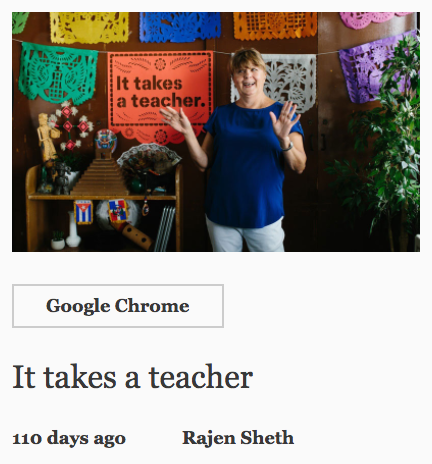
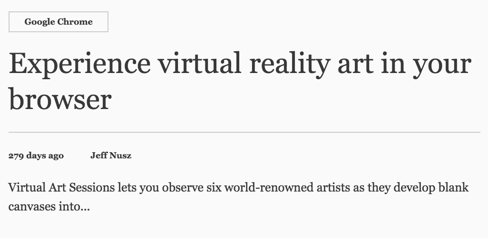
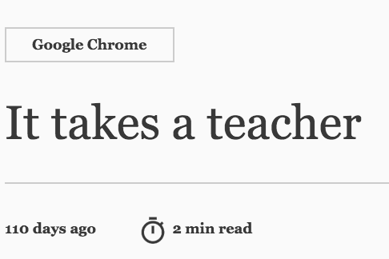

<!-- toc -->

Categories are listed in the definition of the `<news-data>` element:

`news-data.html`
```html
<dom-module id="news-data">
  <script>
  (function() {
    var categoryList = [
      {name: 'top_stories', title: 'Top Stories'},
      {name: 'doodles', title: 'Doodles'},
      {name: 'chrome', title: 'Chrome'},
      {name: 'search', title: 'Search'},
      {name: 'shopping_payments', title: 'Shopping & Payments'},
      {name: 'nonprofits', title: 'Nonprofits'}
    ];
```

# `<category>.json` file specification

Each category must have a `.json` file named after it. The `<category>.json` file stores metadata for the articles in that category.

A `<category>.json` file contains an array of objects representing news articles in that category. For example:

[chrome.json](https://github.com/Polymer/news/blob/master/data/chrome.json)
```javascript
[{
    "title": "Experience virtual reality art in your browser",
    "time": "Tue, 19 Apr 2016 18:50:00 +0000",
    "author": "Jeff Nusz",
    "category": "Google Chrome",
    "id": "experience-virtual-reality-art-in-your",
    "link": "https://blog.google/products/chrome/experience-virtual-reality-art-in-your/",
    "imgSrc": "images/experience-virtual-reality-art-in-your.jpg",
    "placeholder": "data:image/jpeg;base64,/9j/4QAYRXhpZg...AT8Qk3//2Q==",
    "summary": "Virtual Art Sessions lets you observe six world-renowned artists as they develop blank canvases into beautiful works of art using Tilt Brush.",
    "contentLength": 3584},
  {
    "title": "It takes a teacher",
    ...
  }
  ...
]
```

## Properties

### `title`

*Required*

Type: `String`

A human-friendly title for the article.

Example:

`"title": "Experience virtual reality art in your browser"`

### `time`

*Required*

Type: `Date` object, parsable by `new Date(item.time)`

Time the article was published.

Example:

`"time": "Tue, 19 Apr 2016 18:50:00 +0000"`

### `author`

*Required*

Type: `String`

Article author.

Example:

`"author": "Jeff Nusz"`

### `category`

*Required*

Type: `String`

Article category label. This is the category text that appears with the article when it is presented in a list or article view.

Example:

`"category": "Google Chrome"`



### `id`

*Required*

Type: `String` (URL-friendly)

Must be unique and URL-friendly.

Example:

`"id": "experience-virtual-reality-art-in-your"`

### `link`

Optional

Type: `String` (URL)

Not used.

### `imgSrc`

Required

Type: `String` (path)

Path and filename of the image accompanying the article, for display in list views. Relative to `data/`.

`"imgSrc": "images/experience-virtual-reality-art-in-your.jpg"`

### `placeholder`

Optional

Type: `String` (base-64-encoded image)

base64-encoded image to use as a placeholder until the actual image is loaded. Only used for the first article in a category.

Example:

`"placeholder": "data:image/jpeg;base64,/9j/4QAYRXhpZg...AT8Qk3//2Q=="`

### `summary`

*Required*

Type: `String`

Snippet that may be shown in desktop view, depending on viewport.

Example:

`"summary": "Virtual Art Sessions lets you observe six world-renowned artists as they develop blank canvases into beautiful works of art using Tilt Brush."`



### `contentLength`

*Required*

Type: `Integer`

Used to calculate read time. Doesn't necessarily need to be accurate.

Example:

`"contentLength": 6746`


