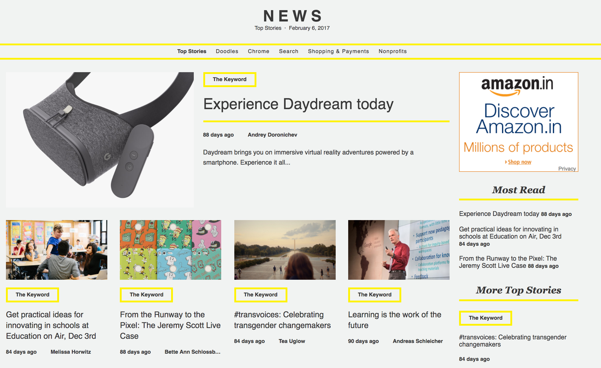
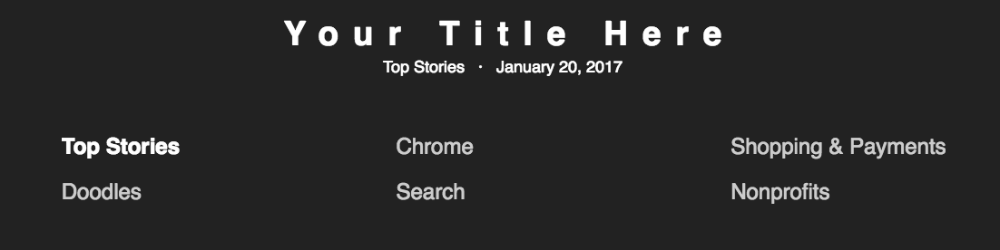
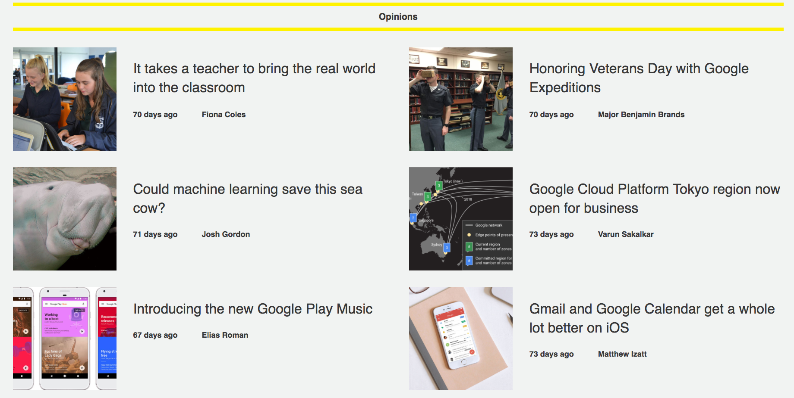
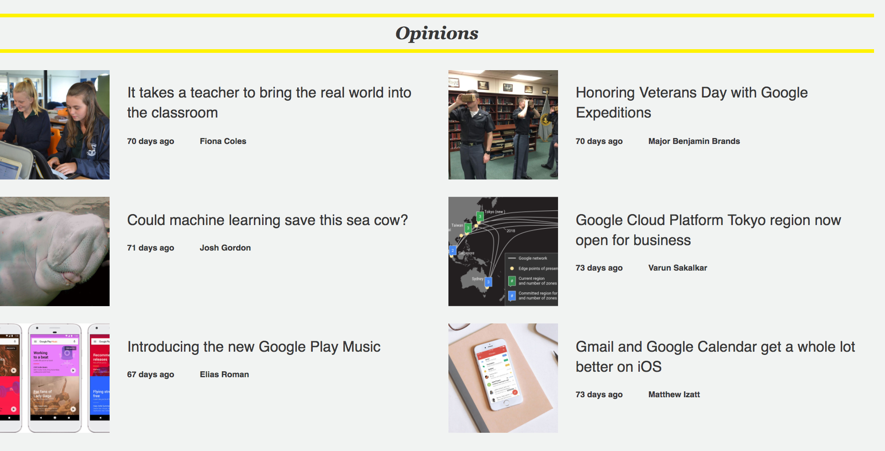
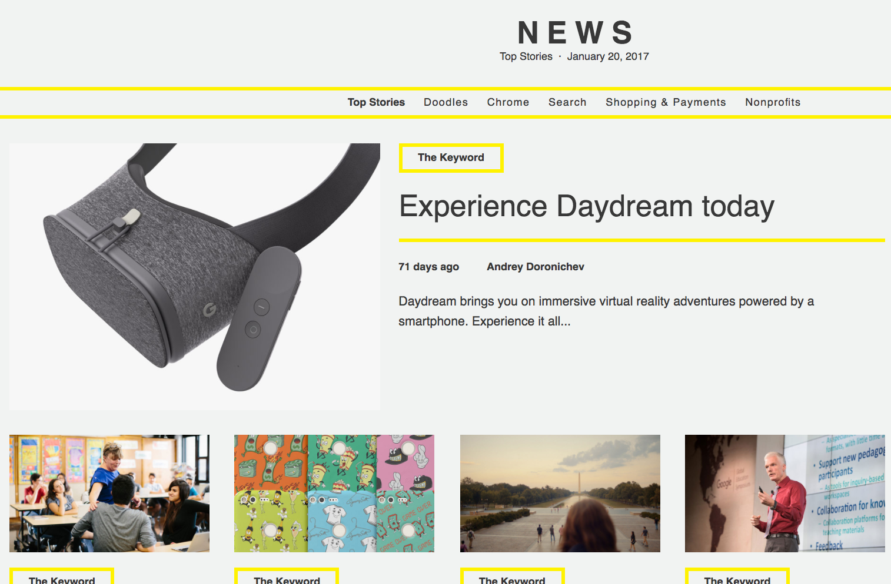
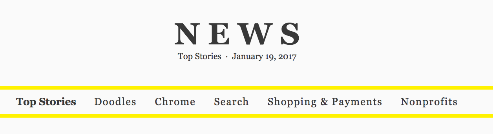
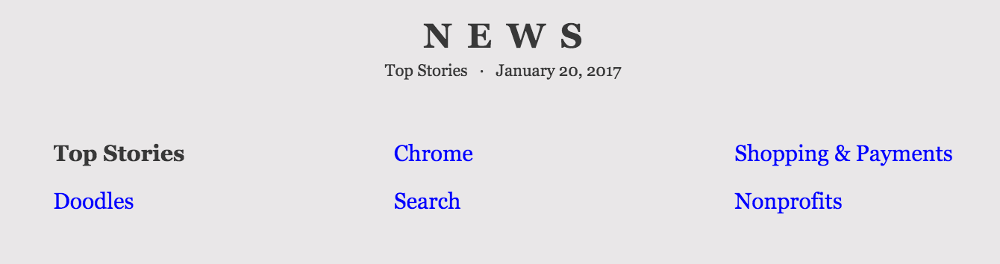
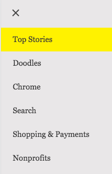
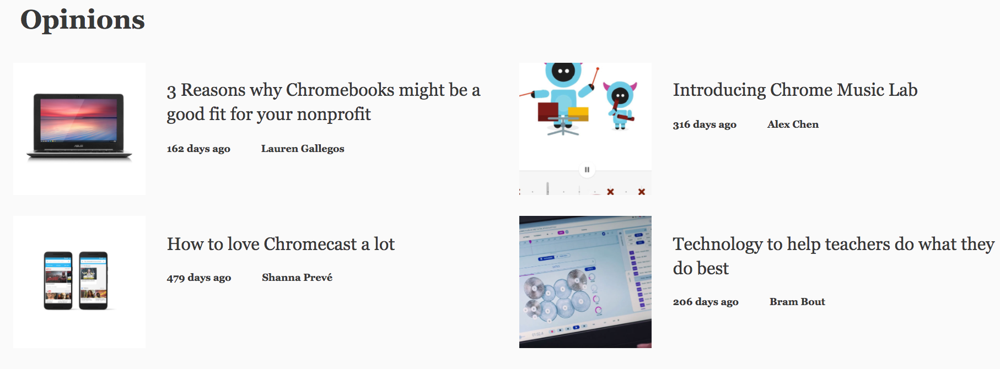

# Theming and Styling the News App

The look and feel of the News app is mostly controlled by the custom properties defined in `news-app.html`. However, to avoid FOUC on browsers in which custom properties have no native implementation, the following properties are defined with literal values in index.html:

* Page background color
* Font
* Text color

## Basic theming for the News app

Broad changes to the look and feel of the News app can be made with a few properties in `index.html` and `news-app.html`. Here's how to modify:

* The [page background color](#page-background-color) used throughout the app
* The main [font](#font) used in the app
* The [text color](#text-color)
* The [border styles and colors](#border-style) used throughout the app

### Page background color

To change the page background color for the whole app, edit the value of background-color for the `<body>` element in `index.html`:

`index.html`
```html
<style>
	body {
		...
		background-color: #FAFAFA;
		...
	}
</style>

```

### Font

To change the font for the app headlines, article text and main title, edit the value of font-family for the `<body>` element in `index.html`:

`index.html`
```html
<style>
	body {
		...
		font-family: Georgia;
		...
	}
</style>
```

### Text color

To change the text color for the app headlines, article text and main title, edit the value of color for the `<body>` element in `index.html`:

`index.html`
```html
<style>
	body {
		...
		color: #383838;
		...
	}
</style>
```

This controls the font and text color inside the shadow trees of elements inside the `<body>` tags, since these properties are inherited.

### Border styles and colors

To change border styles and colors throughout the app, edit the value of `--app-border-style` and `--app-transparent-border-style` in `news-app.html`:

`news-app.html`
```html
<style>
	:host {
		...
		--app-border-style: 5px solid #FFF200; 
    	--app-transparent-border-style: 1px solid #FFF200;
    	...
	}
</style>
```


## Tutorial: Modify the News theme

In this tutorial, we modify the look and feel of the News theme from [the defaults](https://polymer-news.appspot.com/) to match [this design](https://polymer-news-theming.appspot.com).

Before:


After:



We'll take these steps:

* [Modify the site name](#modify-the-site-name)
* [Modify the page background color and font family](#modify-the-page-background-color-and-font-family)
* [Modify border and sticky nav bar styles](#modify-border-and-sticky-nav-bar-styles)
* [Modify sub-section headline styles in the list view](#modify-sub-section-headline-styles-in-the-list-view)

### Modify the site name

In `index.html`, change the document title and the value of the `app-title` property and the contents of `<news-app>` from "NEWS" to your choice of title.

`index.html`
```html
<head>
	<meta charset="utf-8">
	<meta name="viewport" content="width=device-width, minimum-scale=1.0, initial-scale=1.0, user-scalable=yes">
	<title>Your Site Title</title>
	<link rel="shortcut icon" sizes="32x32" href="/images/news-icon-32.png">
	<meta name="theme-color" content="#000">
	<link rel="manifest" href="/manifest.json">
	...
</head>
...
<body>
	<news-app unresolved app-title="Your Site Title">Your Site Title</news-app>
</body>
```

Before:


After:


### Modify the page background color and font family

In `index.html`, change the value of the background-color property to `#F1F3F2`. Also, change the value of `font-family` to `sans-serif`.

`index.html`
```html
<style>
	body {
		margin: 0;
		background-color: #F1F3F2;
		color: #383838;
		font-family: sans-serif;
		min-height: 100vh;
		-webkit-tap-highlight-color: rgba(0, 0, 0, 0);
	}
	...
</style>
```

Before:


After:


### Modify border and sticky nav bar styles

To modify border and sticky nav bar styles, we'll edit the values of the custom properties that control them. These properties are stored in `news-app.html`. Edit this file as follows:

`news-app.html`: Before
```html
<style>
	--app-border-style: 1px solid #CCC;
	--app-transparent-border-style: 1px solid rgba(255, 255, 255, 0.5);
	--app-button-border-style: 2px solid #222;
	--app-cover-text-color: #FFF;
	--app-nav-background-color: #222;
	--app-nav-text-color: #FFF;
	--app-nav-deselected-text-color: #CCC;
	--app-nav-selected-background-color: #555;
	...
</style>
```

`news-app.html`: After
```html
<style>
	--app-border-style: 5px solid #FFF200;
	--app-transparent-border-style: 1px solid #FFF200;
	--app-button-border-style: 2px solid #FFF200;
	--app-cover-text-color: #FFF;
	--app-nav-background-color: #E9E7E8;
	--app-nav-text-color: #383838;
	--app-nav-deselected-text-color: #888;
	--app-nav-selected-background-color: #FFF200;
	...
</style>
```

For more information on what these custom properties control, see the [Custom Properties Reference](#custom-properties-reference) below.

Before:




After:


### Modify sub-section headline styles in the list view

In `news-app.html`, update the `--app-sub-section-headline` mixin.

* Change the value of `border-top` to `none`.
* Change the value of `font-size` to `24px`.
* Add two properties to this mixin: `font-family: "Georgia"` and `font-style: italic`.

`news-app.html`: Before
```html
<style>
	...
	--app-sub-section-headline: {
		border-top: var(--app-border-style);
		border-bottom: var(--app-border-style);
		font-size: 13px;
		padding: 8px;
 		text-align: center;
	};
 	...
 </style>
 ```

`news-app.html`: After
```html
<style>
	...
 	--app-sub-section-headline: {
		border-top: var(--app-border-style);
		border-bottom: var(--app-border-style);
		font-size: 50px;
		padding: 8px;
		text-align: center;
		font-family: "Georgia";
		font-size: 24px;
		font-style: italic;
	};
	...
</style>
```

For more information on what this mixin controls, see the [Custom Properties Reference](#custom-properties-reference).

Before:



After:



The end result can be seen here: [https://polymer-news-theming.appspot.com](https://polymer-news-theming.appspot.com)



## Custom Properties Reference

The following custom properties are defined in news-app.html:

<table>
 <tr>
    <td width="20%">Custom property</td>
    <td width="60%">Description</td>
    <td width="20%">Default</td>
  </tr>
  <tr>
  <td><pre>--app-border-style</pre></td>
    <td>
	<p>The width, style and color of the borders around menu bars, category headers, article headlines and items in list views.</p>
	<p>Examples:</p>
	<p><pre>--app-border-style: 1px solid #CCC;</pre></p>
	
	<p><pre>--app-border-style: 5px solid #FFF200;</pre></p>
	 
    </td>
    <td><pre>1px solid #CCC</pre></td>
  </tr>
  <tr>
    <td><pre>--app-transparent-border-style</pre></td>
    <td><p>The width, style and color of the borders around the date line and featured item above an image. (For performance, this is a separate property.)</p>
	<p>Examples:</p>
	<p><pre>--app-transparent-border-style: 1px solid rgba(255, 255, 255, 0.5);</pre></p>
	
	<p><pre>--app-transparent-border-style: 5px solid #FFF200;</pre></p>
	
    </td>
    <td><pre>1px solid rgba(255, 255, 255, 0.5)</pre></td>
  </tr>
  <tr>
    <td><pre>--app-button-border-style</pre></td>
    <td><p>Width, style and color of borders around buttons. Used in <code>news-network-warning.html</code>.</p></td>
    <td><pre>2px solid #222</pre></td>
  </tr>
  <tr>
    <td><pre>--app-cover-text-color</pre></td>
    <td><p>Color of the text on the featured item in the list view. See [Notes](#notes) below</p>.
	<p>Examples:</p>
	<p><pre>--app-cover-text-color: #FFF;</pre></p>
	
	<p><pre>--app-cover-text-color: orange;</pre></p>
	
	</td>
    <td><pre>#FFF</pre></td>
  </tr>
  <tr>
    <td><pre>--app-nav-background-color</pre></td>
    <td><p>Background of the sticky nav bar/mobile app drawer.</p>
		<p>Examples:</p>
		<p><pre>--app-nav-background-color: #E9E7E8;</pre></p>
		
		<p><pre>--app-nav-background-color: orange;</pre></p>
		
    </td>
    <td><pre>#222</pre></td>
  </tr>
  <tr>
    <td><pre>--app-nav-text-color</pre></td>
    <td><p>Text color for the sticky nav bar/mobile app drawer.</p></td>
    <td><pre>#FFF</pre></td>
  </tr>
  <tr>
    <td><pre>--app-nav-deselected-text-color</pre></td>
    <td><p>Text color of category links in the sticky nav bar menu/mobile app drawer.</p>
	<p><pre>--app-nav-deselected-text-color: #888;</pre></p>
	
	<p><pre>--app-nav-deselected-text-color: blue;</pre></p>
	
    </td>
    <td><pre>#CCC</pre></td>
  </tr>
  <tr>
    <td><pre>--app-nav-selected-background-color</pre></td>
    <td>
		<p>Background color of current category in mobile app drawer.</p>
		<p><pre>--app-nav-selected-background-color: #555;</pre></p>
		
		<p><pre>--app-nav-selected-background-color: #FFF200;</pre></p>
		
	</td>
    <td><pre>#555</pre></td>
  </tr>
  <tr>
    <td><pre>--app-sub-section-headline</pre></td>
    <td><p>Mixin for headlines of the sub-sections in the list view.</p></td>
    <td>See [Notes](#notes).</td>
  </tr>
</table>


### Notes

#### --app-cover-text-color for mobile

For mobile, the equivalent value of `--app-cover-text-color` is hard-coded in `index.html` to allow for browsers that don't support custom properties:

`index.html`
```html
/* mobile */
    @media (max-width: 767px) {
      body {
        background-image: linear-gradient(to bottom, rgba(0,0,0,0.6) 0%, rgba(0,0,0,0.25) 15%, rgba(0,0,0,0.25) 30%, rgba(0,0,0,0.7) 48%, rgba(0,0,0,1) 60%);
        background-repeat: no-repeat;
        background-size: 100% 100vh;
      }
      news-app[unresolved] {
        height: 22px;
        padding-top: 21px;
        font-size: 20px;
        color: #FFF; /* --app-cover-text-color */
      }
    }
```

#### --app-sub-section-headline default values
`news.app.html`
```html
--app-sub-section-headline: {
          border-top: var(--app-border-style);
          border-bottom: var(--app-border-style);
          font-size: 13px;
          padding: 8px;
          text-align: center;
        };
```

With defaults:


With these changes:
```html
--app-sub-section-headline: {
          border-top: none;
          border-bottom: none;
          font-size: 30px;
          padding: 8px;
          text-align: left;
        };
```


## **Reference: Hard-coded values**

To change the page background color, margin, font, and text color for the app, edit this section of index.html:

`index.html`
```html
<style>
    body {
      margin: 0;
      background-color: #FAFAFA;
      color: #383838;
      font-family: Georgia;
      min-height: 100vh; /* Pushes footer content below the fold during initial page load to avoid FOUC */ 
      -webkit-tap-highlight-color: rgba(0, 0, 0, 0); /* Overrides the iOS default transparent grey highlight when tapping a link */
    }
    ...
</style>
```

